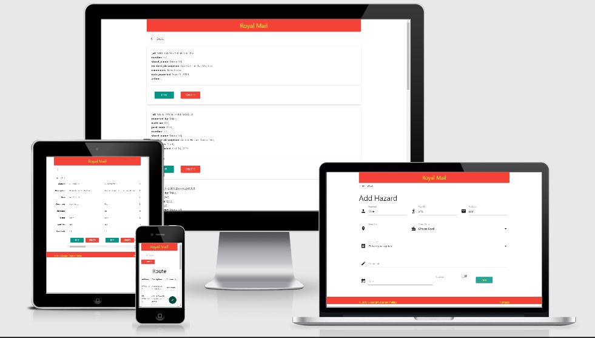

# Postal Reminders
Last year alone over 2500 postal workers suffered from dog bites. That, and other hazards are avoidable 
with the right process in place.

Currently, there is a manual process which is difficult and timely.  

Also, a PW (postal worker) with a regular route is an integral part of that neighbourhood. They know the 
best houses to deliver parcels when the right address is not home. 
They know the many requests that customers they see on their route might have, also they are aware if something is not quite right. 

What happens on their day off or if a new posty takes over their area? All that information
is lost. So here is a simple app to help log all the hazards, access issues and customer requests 
to help maintain consistency and minimise the risk to the postal worker.

## UX

This needed to be very simple and quick to use, otherwise it would not be utilised. All postal workers 
carry a PDA to help log parcel deliveries. They also track the posty's location through GPS positioning. This 
guarantees the post made it to its destination. This app is designed to work on the PDA requiring no extra 
equipment to the already overloaded postal worker.

It is designed to be clear and as few button presses as possible. The PW simply makes a quick log of the 
reminder as they walk between houses and can then be edited when they get back the van. It is vital 
to make the initial log just after the incident so that the postal worker does not forget.

The main screen then shows the basic information that is needed to remind the Postal worker 
the next time they are in the area. A search bar helps narrow the field to the street they are on.

The app is designed to be on a mobile size screen similar to the PDA. It can also be easily viewed 
by a manager back in the office on a laptop. Hense, it is fully responsive on all size screens.

The colours chosen are those of Royal Mail.

## Users
The predominent user is the Postman or women, especially those new to the route. Also, experienced 
Posties can edit the information and add new reminders. The Managers can also check to see
if adequate reporting of hazzards, access issues and customer requests are being logged.

### User Stories
* A new Postal worker is doing a route for the first time. At a glance they can see the potential hazards in the area. Particularly dogs who lie in wait to bite the fingers of the PW as they deliver throuigh the door.
* A Postal worker is delivering to a house with new tenants. As they deliver the tenent asks them to put parcels behind the bin if they are out. The Posty logs this on their PDA.
* A manager checks through the database and sees alot of conmplaints about a loose dog in the area. He can inform the council about the possible homeless dog.
* A Postal worker sees that the elderly resident who they have delivered to every day for years, is now not answering for their deliveries. Prompting a call to local health workers.

## Features
Each main heading brings you to a form with mainly select options. This allows the user to quickly enter information.
They can enter in more comments if needed when they get back to the van where they are out of the elements and not carrying a heavy bag.

There is a condensed table which shows the basic information - Address, reminder and comments. One extra click
brings them to the full table, where they can delete or edit. 

A stylish button in the bottom corner (nearest the thumb, as the PDA is usually carried in the right hand) allows 
the user to log information via a form.

A search bar on the home page and the expended route page helps narrow the selection to the street they are on.

In future, I'd like to incorporate the GPS on the PDA to alert a Postal Worker when they were approaching an address with a reminder.

Also, I would like to use the Royal Mail database for all routes, through the login process. So that it could be used across the country.

As the friendly local PW is the eyes and ears of any cummunity, this app could be extended to check in on the elderly or those with disabilities. 

There could also be an incentive introduced for those PW's who use the app the most.

## Technology Used
* HTML - for the structure of the content of the page
* Materialize - the framwork used to deliver the style and responsiveness
* CSS3 - for making small adjustments to the materialize framework
* Javascript - to initialise some components on the Materialize framework
* Balsamiq - for the wireframe
* Git - for version control
* GitHub - to host the repository
* GitHup Pages - Website hosting.
* Heroku - to deploy the app
* MondoDB - to store the collections
* Flask-Pymongo - for interaction with the front end
* Python - for back end implementation

## Testing

### Manual Tests
I tested myself to ensure the moving from one page to another was seemless and 
that information was correctly logged to MondoDB.
I also gave it to some Postal workers for valualble input on the main reminders to use.

### Automated Tests
* Chrome Developer Tools - to ensure all screen sizes responded correctly
* W3C HTML & CSS Validation - used to test HTML and CSS

## Deployment
The app was developed using AWS Cloud9. The git repository was initiated through 
the bash terminal and regular commits were made after each piece of development. 
The project was then deployed to Heroku through the following steps.

* Created new app titled "postal-hazards-uk"
* The repository was cloned by using: heroku git:clone -a postal-hazards-uk
* A requirments file and procfile was added
* The Git repository was added using: git push heroku master

To deploy your own version:
* Visit the repository [here](https://github.com/bandyp/Postal-Reminders)
* Click 'clone' to copy
* Open your IDE
* Type 'git clone https://github.com/bandyp/Postal-Reminders.git' in the terminal window of the root directory

## Credits
Code institue mentor Suen Owonikoko

The Postal Workers of the Luton Office for suggestions. Particularly Glenn Atkinson and Chris Pratt who have passed on my idea to Senior Directors in Royal Mail.